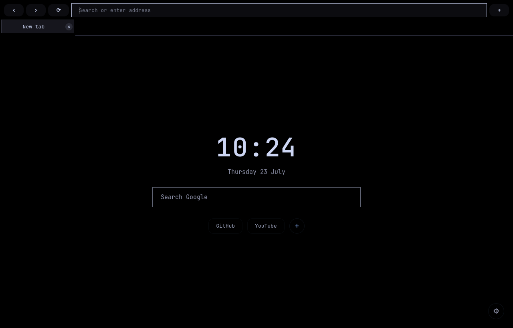
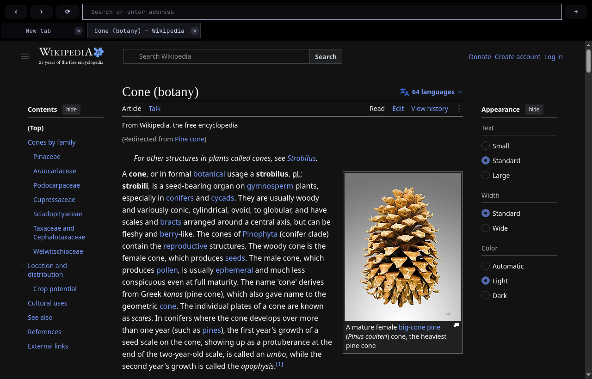

# browser

A dark, keyboard-driven web browser built on Chromium — the Windows edition.
One readable Python file, Qt WebEngine underneath, pitch black with Catppuccin Mocha text —
sharp corners, thin outlines, no clutter. Even Google is black.



## Design principles

**Real web compatibility.** Chromium rendering through Qt WebEngine, with
persistent cookies and logins. Sites behave as they do everywhere else.

**Everything in one file.** The whole application is a single `browser.py`
you can read end to end. No build step, no plugin framework, no dependency
tree to audit.

**Dark by default, not by filter.** Sites that ship a dark theme are asked
for it. Light-only sites are darkened automatically. Sites that are already
dark are left alone, which keeps heavy pages fast.

**Nothing leaves the machine that you did not ask for.** No telemetry, no
account, no sync. Browsing data stays in `%LOCALAPPDATA%\browser\`.

## Features

### Browsing

- **Tabs and tab groups** — Chrome-style group pills, collapsible, colour-coded
- **Virtual browsers** — several independent sessions in one window, each with
  its own cookie jar and logins; sign in to the same site twice without
  signing out
- **Find in page** (`Ctrl+F`) — match count, next/previous, match case
- **Tab search** (`Ctrl+Shift+A`) — every open tab of every virtual browser in
  one filtered list
- **Reopen closed tab** (`Ctrl+Shift+T`) — restores its position and its group
- **Smart address bar** — URLs, search, and live suggestions in one field
- **A toolbar you choose** — which buttons sit at the top, and in what order,
  is yours: right-click the bar, or **Settings → Toolbar**. Back, forward,
  reload and the address bar stay. Taking a button away never touches its
  keyboard shortcut
- **Panes, not pages** — Settings, Downloads, History, Bookmarks and the
  password manager open over what you were looking at and leave on `Esc`.
  They cost no tab, no history entry and no address bar
- **A way home** — `Alt+Home` and a ⌂ button, even when new tabs open on a
  page of your own
- **Fullscreen video**, background tabs, sleeping tabs restored on demand

### Downloads and printing

- **Download manager** — a downloads page and a toolbar bar with progress,
  speed and time remaining; pause, resume, cancel; history that survives
  restarts
- **Print or save as PDF** (`Ctrl+P`) — the PDF lands in the downloads list
  alongside everything else

### Privacy and security

- **Vault Password** — the built-in password manager. Optional: setup asks
  whether you want it, and Settings → Plugins switches it on or off at any
  time. Off means off — the login watcher is never put into a page, so no
  form is looked at and nothing is ever written to the vault. Switching it
  off deletes nothing. When it is on: a manager page of its own
  (Ctrl+Shift+P) with search, secure notes, payment cards and identities,
  a generator (Ctrl+Shift+G), two-factor codes with a countdown, a health
  check and CSV import/export — or 1Password as the store instead, through
  the official `op` tool. It offers to save logins and fills them back in
  on a real click, and the saved password is withheld from page scripts
  until you actually interact with the form, so an injected script reads an
  empty field.
- **Per-site proxy routing** — send chosen sites through a proxy while
  everything else goes direct, or the reverse. Rules are enforced by a
  built-in local proxy and fail closed: a rule pointing at a dead proxy
  blocks the site rather than quietly going direct.
- **Site permissions** — microphone, camera and notification requests are
  asked per origin and remembered per origin, scheme and port.
- **History control** — pause it, search it, or clear it
- **Trust boundary** — the browser's own pages get a privileged bridge to the
  application; websites never do, and cannot reach it through the underlying
  channel

### Setup and configuration

- **Setup** — an eight-step first run: language, theme, search engine, start
  page, site behaviour, privacy, quick links, summary. Re-runnable at any time.
- **Settings** — opens as a pane over the window rather than a page you
  navigate to, so it costs no tab and no history entry
- **114 themes** — three shelves, searchable, applied the moment you click one
- **When the browser starts** — the start page, or an address of your own,
  set separately from what a new tab shows
- **Start page** — clock, search, editable quick links, background images
  (bundled or your own)
- **Userscripts** — Greasemonkey-style `*.user.js` files, per profile
- **Interface translations** — the UI follows the language you choose
- **Single instance** — links from other applications open as tabs in the
  running window; works as the system default browser
- **Built-in updates** — pulls the newest version from this repository

## Screenshots



*Wikipedia has no dark theme of its own — the browser darkens it. A site
that serves its own dark theme is left alone.*

## Install

Download this repository (**Code → Download ZIP**), unzip it somewhere
permanent, and run **`install.bat`**.

The installer fetches Python through winget if it is missing, installs PyQt6
WebEngine, and puts a *Browser* shortcut on your desktop.

To run it without installing:

```
py -3 browser.py
```

Requirements: Python 3 and PyQt6 WebEngine.

If the desktop shortcut ever loses its icon and stops responding, the folder
has been moved or renamed — run `install.bat` again from its new location to
rebuild the shortcut.

## Keyboard shortcuts

Shortcuts are handled by the browser itself, so they behave the same on any
desktop or window manager with no system configuration.

| Key | Action |
|-----|--------|
| `Ctrl+T` | New tab |
| `Ctrl+W` | Close tab |
| `Ctrl+Shift+T` | Reopen closed tab |
| `Ctrl+L` | Focus address bar |
| `Ctrl+F` | Find in page |
| `Ctrl+P` | Print or save as PDF |
| `Ctrl+Shift+A` | Search open tabs |
| `Ctrl+Tab` / `Ctrl+Shift+Tab` | Next / previous tab |
| `Shift+Tab` | Next virtual browser |
| `Ctrl+R` / `F5` | Reload |
| `Alt+Home` | Start page |
| `Ctrl+H` | History |
| `Ctrl+J` | Downloads |
| `Ctrl+Shift+O` | Bookmarks |
| `Ctrl+Shift+P` | Passwords |
| `Ctrl+,` | Settings |
| `F11` | Fullscreen |
| `F12` / `Ctrl+Shift+I` | Developer tools |
| `Ctrl+Q` | Quit |

History, Downloads, Bookmarks, Passwords and Settings open as panes, and the
same key closes the one it opened. `Esc` closes any of them.

## Configuration

Most settings live in the settings pane (`Ctrl+,`), stored in
`%LOCALAPPDATA%\browser\config.json`. The sources are short and meant to be
edited for anything beyond that:

| Path | Contents |
|------|----------|
| `browser.py` | Application code. Interface colours are in the `STYLE` string; sites that skip auto-darkening are listed in `NATIVE_DARK_SITES`. |
| `start.html` | Start page and first-run setup. |
| `settings.html` | Settings pane. |
| `history.html`, `downloads.html` | History and downloads pages. |
| `backgrounds/` | Bundled background images. |

The theme is pitch black (`#000000`) with
[Catppuccin Mocha](https://catppuccin.com/palette/) text colours.

User data — history, settings, saved logins, downloads and cookies — is
stored under `%LOCALAPPDATA%\browser\`. Saved passwords are obfuscated with a
per-install key file; the security boundary is your operating system account,
not a master password. The vault file is given an ACL of its own — this user,
nobody else — because the POSIX `chmod` the code used to rely on does nothing
at all on Windows.

## Linux

The Linux edition, with the same feature set, is maintained at
[idkhowtonamemyselfasadev/browser](https://github.com/idkhowtonamemyselfasadev/browser).

This edition is a regeneration of it, not a fork. Every feature is written
there and arrives here; the only things that belong to this repository are a
handful of Windows-specific regions — where data is stored, the zip updater,
the file ACL on the vault, the taskbar identity and the font stacks.

### Bringing it up to date

```
tools/win_port.py --to <linux-commit> --dry-run   # report, write nothing
tools/win_port.py --to <linux-commit>             # regenerate
tools/win_port.py --check                         # verify the tree as it is
tools/runall.sh                                   # the offscreen test suite
```

`browser.py` is a three-way merge — the base is the Linux commit this tree was
last generated from, which `tools/win_port.json` records — so the Windows
regions sit on our side of the merge and survive without anyone having to
remember them. The pages and the test suite are copied from the same commit,
the font stacks are substituted, and then every Windows region has to prove it
is still there. If one is missing, nothing is written at all.

`tools/win_port.json` is the data: what merges, what is copied, the
substitutions and why, the two files this edition deliberately changes, and
the checks that must pass afterwards. It refuses rather than guesses — a merge
conflict, a substitution that stopped matching, or a page edited by hand here
all stop it and say what to do.

The Windows-only code paths cannot run on the machine this is built on, so
they are covered by `--check` rather than by tests. Everything else is covered
by the Linux suite, run here against this `browser.py`.

## Uninstall

Delete the *Browser* shortcut from your desktop and remove the folder you
unzipped. Browsing data in `%LOCALAPPDATA%\browser\` can be removed
separately.
